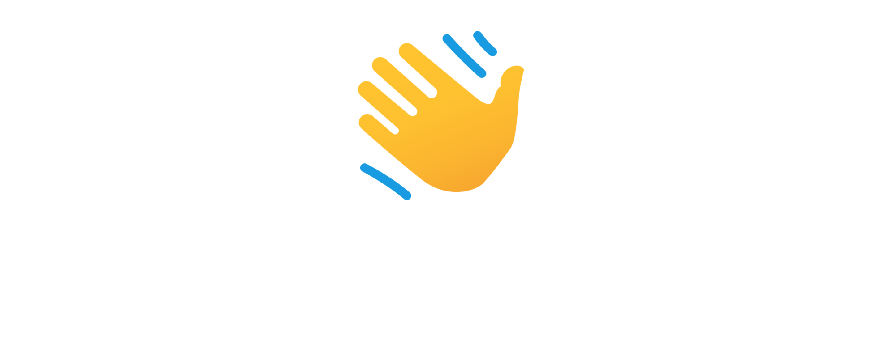

<div align="center">
  <!--  -->
  <a href="https://jm26.net" alt="JMcrafter26">
  
  </a>

</div>

<h3 align="center">
  <!-- Welcome to John's GitHub Profile! -->
  <!--  -->
</h3>

-   Hi, I’m John aka <a href="https://jm26.net">@JMcrafter26</a>, aka <a href="https://jm26.net">JM26</a>
-  I’m interested in working with Full Stack Web Development Projects, Designing Webpages and anything related to Competitive Programming.
- 🌱 I’m currently learning C# and Unity
- 📫 You can reach out to me at system-administrator@jm26.net
- 🤝 What I like doing: Creating high quality [repositories](https://github.com/JMcrafter26?tab=repositories)
- 😁 Fun Fact: ```What color is your Bugatti?```


<p align="center"> 
  <a href="https://github.com/jmcrafter26?tab=repositories&sort=stargazers"></a>
  <a href="https://github.com/jmcrafter26?tab=followers">
    </a>
</p>
<!-- Profile Views -->
<p align="center">  </p>

## 🌐 Socials: 
<div align="center">
    <a href="https://github.com/jmcrafter26"></a>
  </div>

## 📊 GitHub Stats:

<div align="center">
  
  <br>
  <br>
  
  <br>
  </div>
<details><summary> Show More Stats</summary>

<div align="center">

  <br>
  
  <br>
</div>

<h2> Coding Activity </h2>

<div align="center">
  
</div>

<h2> 📈 Productivity Stats </h2>

<table align="center">
  <tr>
    <td></td>
  </tr> 
</table>

 

<h2> 🏆 Trophies </h2>
<div align="center">
  
</div>
<br>

[](https://github.com/ashutosh00710/github-readme-activity-graph)
</details>

 

## 🐍 Watch My Contribution Graph get eaten by Snake 


 

### ✍️ Random Dev Quote

